# Lab 8 Batch Data Pipeline

- Installing Softwares
- Scenario: Carpark system \
    Generate, process and save the data every 5 mins for reporting.

Create a new jupyter notebook file "batch_data_pipeline.ipynb".


```python
# import libraries

from faker import Faker
import json
from datetime import datetime, timedelta, time
import random
import pandas as pd
import matplotlib.pyplot as plt

date_format = "%d/%m/%Y %H:%M:%S"
```

# 1. Installing Softwares or Import softwares

You can follow the instructions 

- (section 1.0) to import all the softwares from the Amazon Machine Images (AMIs) into your EC2 instance
OR
- (optional: section 1.1 to 1.4) to install the softwares for lab8 

Do ensure your region is set to "ap-southeast-1" and send your AWS account ID to gmscher@nus.edu.sg for access.

# 1.0 Import Amazon Machine Images (AMIs) into your EC2 instance.

1. In AWS Console, go to EC2 > Launch Instance. 

    Name and tags: ```ee3801_part2_lab8```

    Application and OS Images (AMI): Select MyAMIs > Shared with me > ee3801_part2_lab8_ami

    Instance type: ```t2.xlarge```

    Key pair: ```MyKeyPair```

    Network settings: Create security group\
        select ```Allow SSH traffic from Anywhere 0.0.0.0/0```\
        select ```Allow HTTPS traffic from the internet```\
        select ```Allow HTTP traffic from the internet```

    Configure storage: 1x ```60``` GiB ```gp2```

    ```Launch instance```


2. Open AWS Console > EC2 Instance > Security > Click on Security groups > Edit inbound rules > Add rules

    Type: SSH, Port range: 22, Source: Custom, 0.0.0.0/0\
    Type: Custom TCP, Port range: 5601, Source: Custom, 0.0.0.0/0\
    Type: Custom TCP, Port range: 8080, Source: Custom, 0.0.0.0/0\
    Type: Custom TCP, Port range: 5432, Source: Custom, 0.0.0.0/0\
    Type: Custom TCP, Port range: 29092, Source: Custom, 0.0.0.0/0\
    Type: Custom TCP, Port range: 39092, Source: Custom, 0.0.0.0/0\
    Type: Custom TCP, Port range: 49092, Source: Custom, 0.0.0.0/0\
    Type: Custom TCP, Port range: 9200, Source: Custom, 0.0.0.0/0\
    Type: HTTPS, Port range: 443, Source: Custom, My IP

3. Now you can skip to section 2.
   
4. Test your installation and ensure you can access Apache Airflow, PostgreSQL, PGAdmin, Elasticsearch and Kibana.


# 1.1 Install docker and configure AWS EC2 (optional)

1. Open a command line or terminal, create AWS EC2 instance with 60GB storage space and 16 GB RAM. 

    ```
    $ aws ec2 run-instances --image-id resolve:ssm:/aws/service/ami-amazon-linux-latest/amzn2-ami-hvm-x86_64-gp2 --instance-type t2.xlarge --key-name MyKeyPair --block-device-mappings '[{"DeviceName":"/dev/xvda","Ebs":{"VolumeSize":60,"VolumeType":"gp2"}}]' --tag-specifications 'ResourceType=instance,Tags=[{Key=Name,Value=ee3801_part2_lab8}]'
    ```

    If you have the error "You must specify a region. You can also configure your region by running "aws configure", go to lab 1 > Part 2 > Step 4 and install AWS CLI. https://github.com/EE3801/Lab1/blob/main/src/part-a/1.md 

2. Open AWS Console > EC2 Instance > Security > Click on Security groups > Edit inbound rules > Add rules

    Type: SSH, Port range: 22, Source: Custom, 0.0.0.0/0\
    Type: Custom TCP, Port range: 5601, Source: Custom, 0.0.0.0/0\
    Type: Custom TCP, Port range: 8080, Source: Custom, 0.0.0.0/0\
    Type: Custom TCP, Port range: 5432, Source: Custom, 0.0.0.0/0\
    Type: Custom TCP, Port range: 29092, Source: Custom, 0.0.0.0/0\
    Type: Custom TCP, Port range: 39092, Source: Custom, 0.0.0.0/0\
    Type: Custom TCP, Port range: 49092, Source: Custom, 0.0.0.0/0\
    Type: Custom TCP, Port range: 9200, Source: Custom, 0.0.0.0/0\
    Type: HTTPS, Port range: 443, Source: Custom, My IP

3. Open terminal or command line.

    ```$ cd ~/Documents/projects/ee3801```

2. SSH into the instance that you just created. Copy the ```<ip_address>``` from the AWS EC2 instance you just created.

    ```$ ssh -i "MyKeyPair.pem" ec2-user@<ip_address>```

3. Update packages.

    ```$ sudo yum update -y```

4. Install Docker

    ```$ sudo amazon-linux-extras install docker```

5. Start Docker Service

    ```$ sudo service docker start```

6. Configure User for Docker. Add the current user (e.g. ```ec2-user```) to the ```docker``` group to run Docker commands without ```sudo```.

    ```$ sudo usermod -a -G docker ec2-user```

7. Log out and log back in (or restart your SSH session) for the group changes to take effect.

8. Verify Installation. Run ```$ docker ps -a``` to verify that Docker is installed and running. You should see output indicating that no containers are currently running.

9. Download docker-compose.

    ```$ sudo curl -L "https://github.com/docker/compose/releases/download/v2.27.0/docker-compose-$(uname -s)-$(uname -m)" -o /usr/local/bin/docker-compose```

10. Make it executable.

    ```$ sudo chmod +x /usr/local/bin/docker-compose```

11. Verify.

    ```$ docker-compose --version```

# 1.2 Install Airflow and postgresql (optional)

1. In the local machine command line or terminal, go to the working directory and SSH into server. 

    ```$ cd ~/Documents/projects/ee3801```\
    ```$ ssh -i "MyKeyPair.pem" ec2-user@<ip_address>```

2. In your project folder, create a airflow folder.

    ```$ mkdir dev_airflow``` \
    ```$ cd dev_airflow```

3. Download Apache Airflow's docker installation procedure. 

    ```curl -LfO 'https://airflow.apache.org/docs/apache-airflow/stable/docker-compose.yaml'```

4. Edit docker-compose.yaml to add "ports: - "5432:5432"" for postgres.

    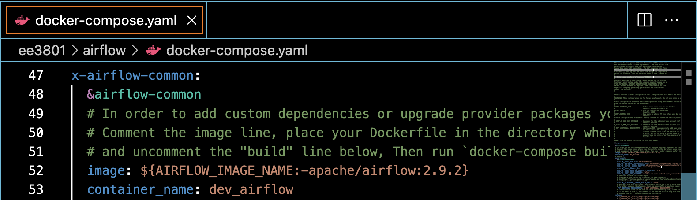
    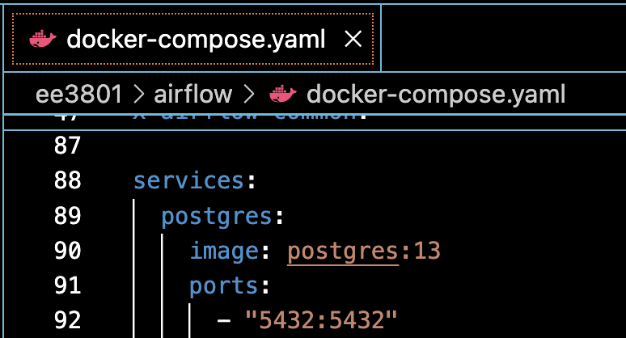

5. Navigate into the airflow folder and create the folders for airflow.

    ```$ mkdir -p ./dags ./logs ./plugins ./config```

6. Prepare the environment.

    ```$ echo -e "AIRFLOW_UID=$(id -u) \nAIRFLOW_PROJ_DIR=~/dev_airflow" > .env```\
    ```$ more .env```

7. Build the docker.

    ```$ docker-compose up airflow-init```\
    ```$ docker-compose up```

8. ```Ctrl+C``` at the command line. Logout and log back in. Start the docker service (another way to start).

    ```$ sudo systemctl restart docker```

    Note: Wait for dev_airflow-airflow-apiserver-1 to start up healthy status. 

9. In your browser, go to <a href="http://<ip_address>:8080">http://<ip_address>:8080</a>. Login user: airflow, password: *******. If you cannot access, modify the ip address to your ec2 instance ip address.

10. In the command line enter ```docker ps -a```, you should be able to see the containers in dev_airflow running. You can also see that postgresql is installed.

    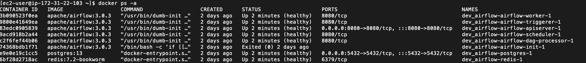

11. Next we want to configure the postgresql. In the terminal, access the docker "dev_airflow-postgres-1" container and check the postgresql version. 

    ```$ docker exec -it dev_airflow-postgres-1 /bin/bash```\
    ```$ postgres -V```

    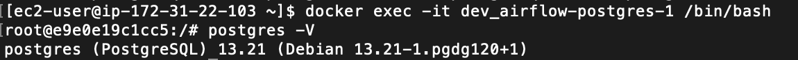 
    <br>


12. Access postgresql in terminal, create database ```carpark_system``` and list database. Type ```exit``` and ```exit``` to exit postgresql console and container.

    ```psql -U airflow```\
    \
    ```CREATE DATABASE carpark_system;```\
    \
    ```\l```\
    \
    ```exit```\
    \
    ```exit```

    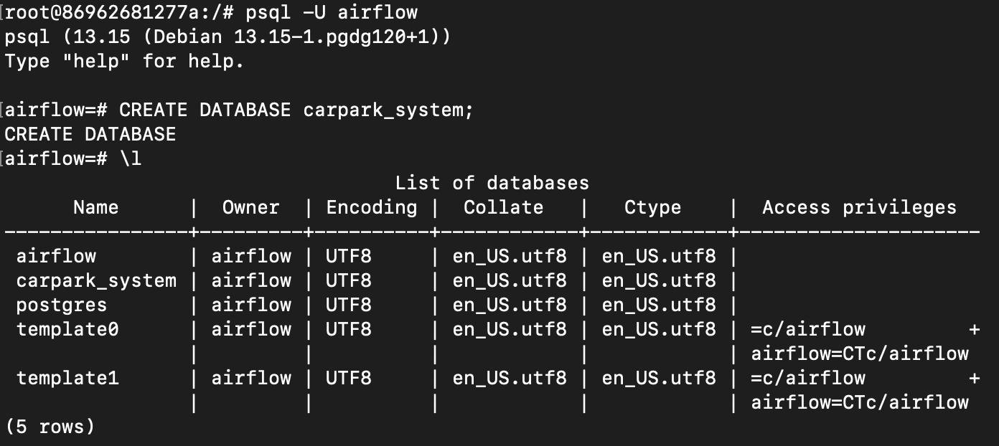


# 1.3 Install pgadmin4 (optional)

1. Install pgadmin4. For this lab your email: ee3801@nus.edu.sg and password: ******.

    ```$ docker pull dpage/pgadmin4```
    
    ```$ docker run --name dev_pgadmin4 -p 80:80 -e 'PGADMIN_DEFAULT_EMAIL=<youremail>' -e 'PGADMIN_DEFAULT_PASSWORD=<yourpassword>' -d dpage/pgadmin4:latest```

    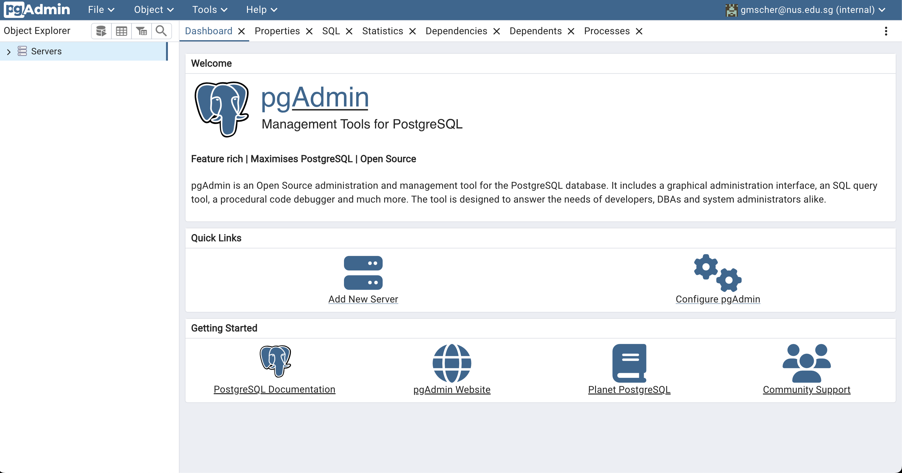

2. In your browser, go to <a href="http://<ip_address>">http://<ip_address></a>. Click on Add New Server and configure the server.

    Name: dev_airflow-postgres-1 \
    Host: <ip_address> \
    Database: postgres \
    Username: airflow \
    Password: *******

    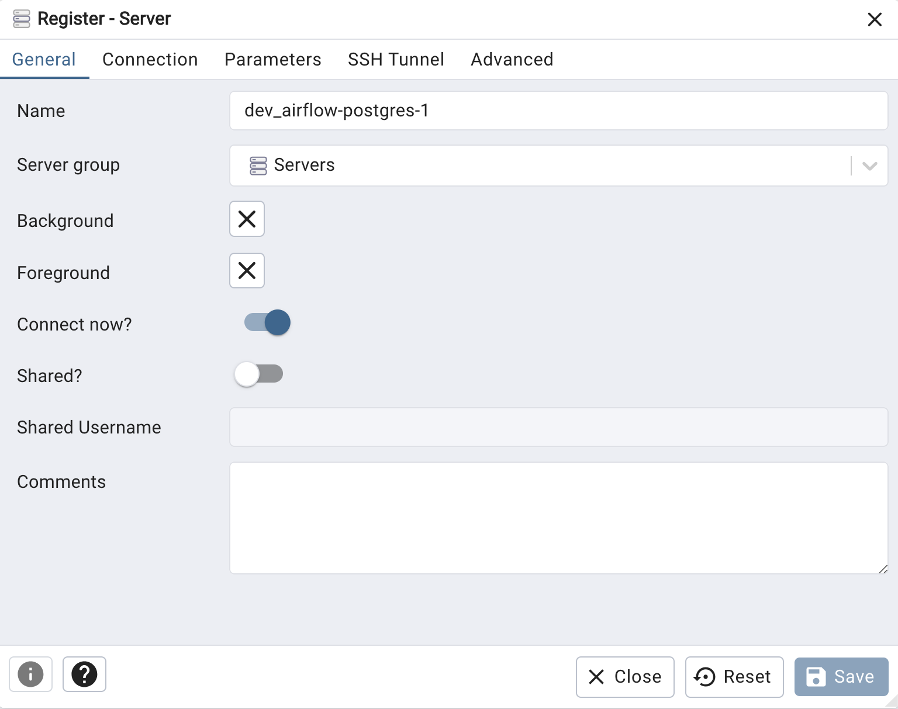
    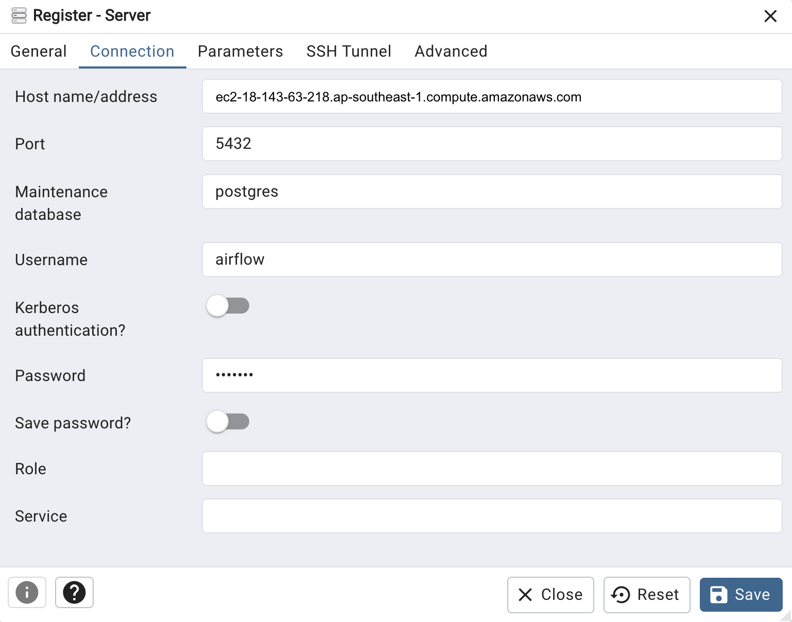
    

3. Create Table by right click on Database > carpark_system > Schemas > public > Tables. Save. If connection fail, modify the ip address to your current ec2 instance ip address.

    General > Name: CarPark
    Columns
    - Plate, text
    - LocationID, text
    - Entry_DateTime, timestamp without time zone
    - Exit_DateTime, timestamp without time zone
    - Parking_Charges, numeric

    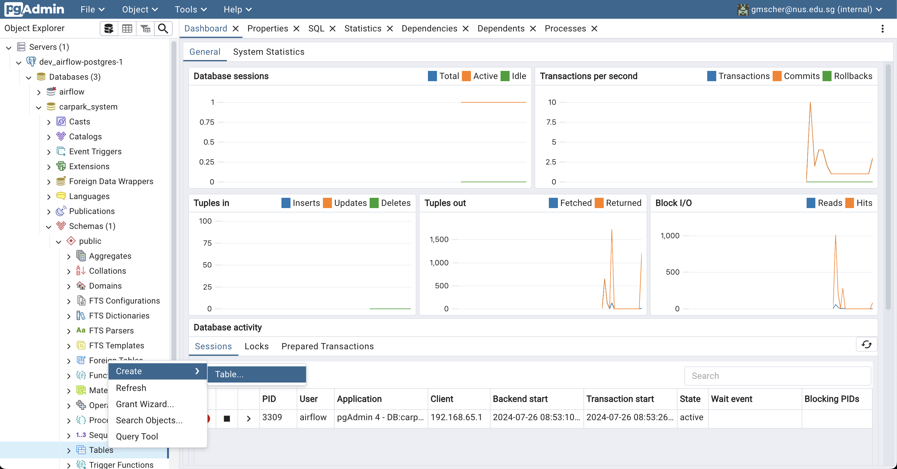
    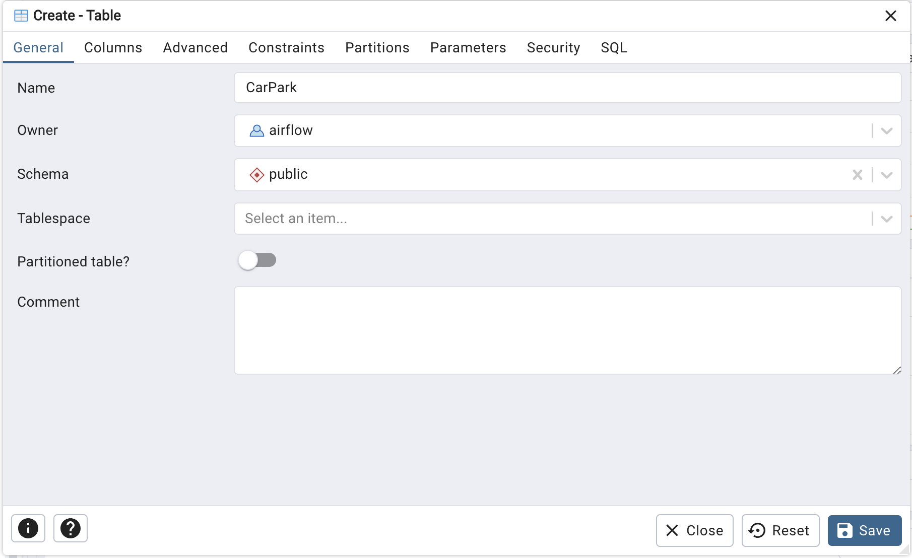
    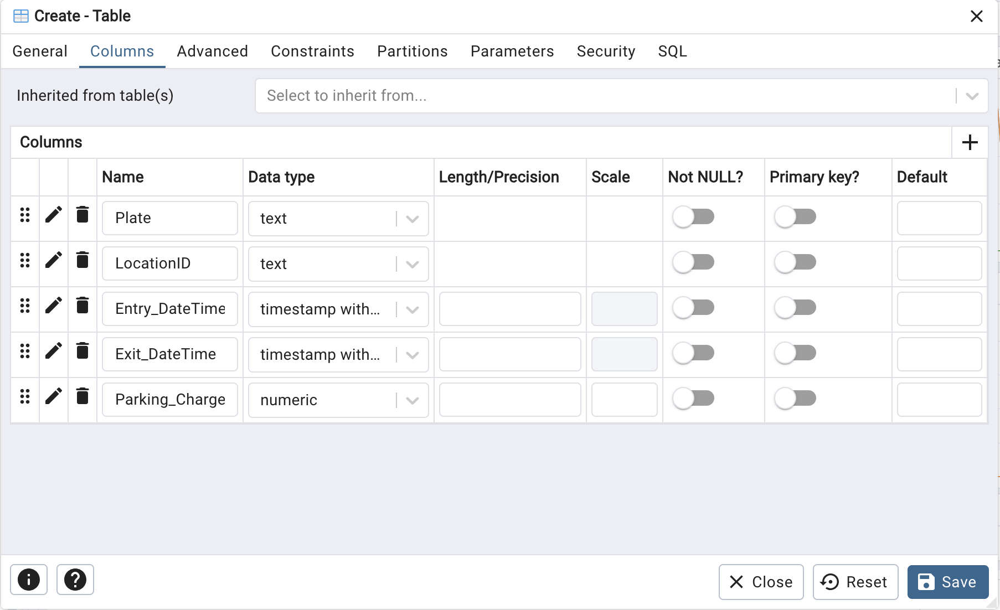
    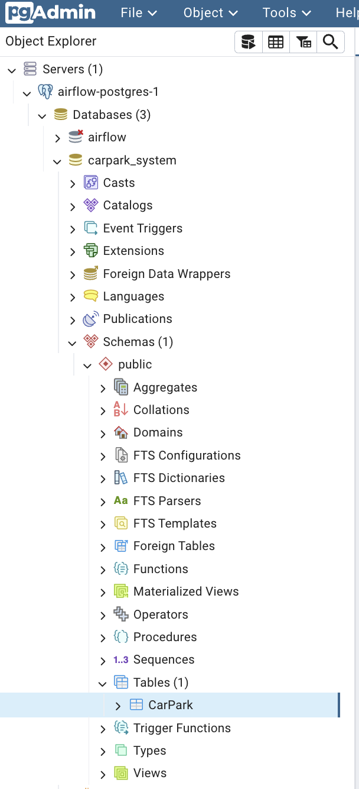


# 1.4 Install elasticsearch and kibana (optional)

1. In the server, create directory ```elasticsearch``` and go to directory.

    ```$ mkdir ~/elasticsearch```\
    ```$ cd ~/elasticsearch```

2. Create docker network.

    ```$ docker network create elastic```

3. Run the command to get the docker image.

    ```$ docker pull docker.elastic.co/elasticsearch/elasticsearch:9.0.4```

4. Run the docker container and name it dev_es01.

    ```$ echo "vm.max_map_count=262144" | sudo tee -a /etc/sysctl.conf```\
    ```$ sudo systemctl restart docker```
    ```sudo sysctl -w vm.max_map_count=262144```
    ```$ docker run --name dev_es01 --net elastic -p 9200:9200 -it -m 1GB docker.elastic.co/elasticsearch/elasticsearch:9.0.4```

5. Take note of the password for elactic user, CA certificate and enrollment token for kibana generated. 

6. ```Ctrl-C``` at terminal and start the dev_es01 service in docker dashboard.

    ```$ docker start dev_es01```

7. Download http_ca_crt and test the access using curl. Replace the <elastic_password> with the one you copied in step 5.

    ```$ cd ~/elasticsearch```

    ```$ docker cp dev_es01:/usr/share/elasticsearch/config/certs/http_ca.crt .```\

    ```$ curl --cacert http_ca.crt -u elastic:<elastic_password> https://localhost:9200```

    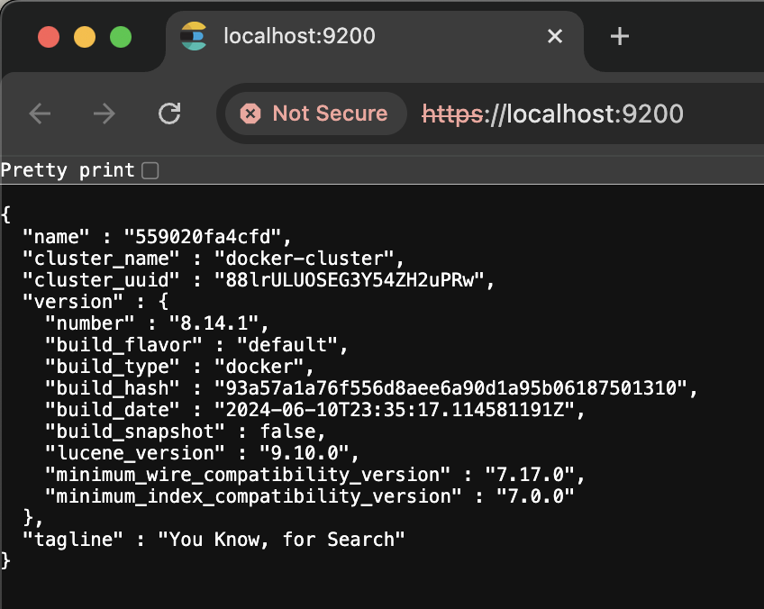

8. Create a data directory for kibana.

    ```$ mkdir -p ~/kibana/data```\
    ```$ cd ~/kibana```
    
9. Download docker image and run the docker container for kibana. ```Ctrl-C``` at terminal and start the dev_kib01 service in docker dashboard. 

    ```$ docker run --name dev_kib01 --net elastic -v ~/kibana/data:/usr/share/kibana/data -p 5601:5601 docker.elastic.co/kibana/kibana:9.0.4```

    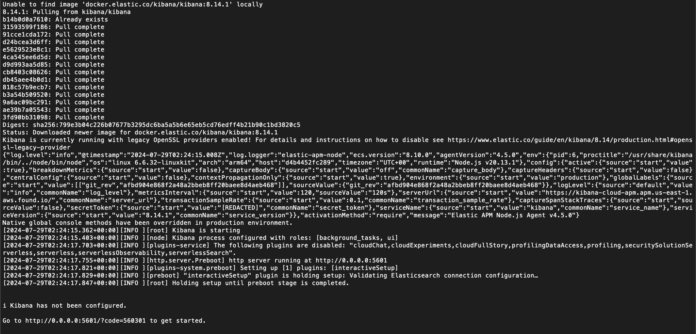
    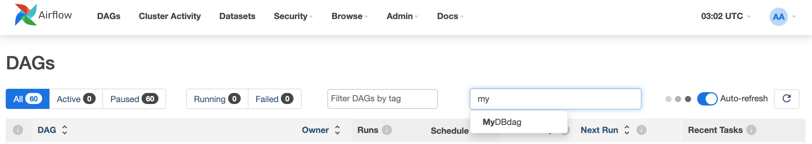

10. In the browser, go to ```https://<ip_address>:5601/?code=******```. Enter username elastic and its password. 


    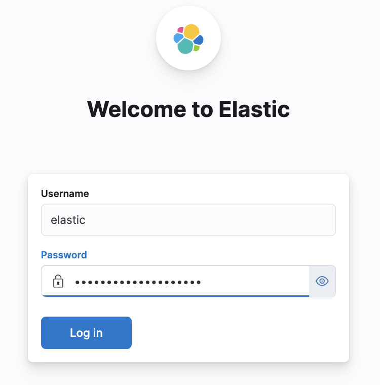


# 2. Scenario: Carpark system (daily reporting)

The organisation has a carpark system to monitor Cars entering and exiting carparks. The data that you are capturing is car plate number, time of entry, time of exit and the carpark. The rate of parking is 60 cents per half an hour. There are multiple stakeholders across the organisation accessing the data on-demand every 5 minutes to check on the status of the earnings through the parking system. Your company does not subscribe to Microsoft Power Platform. 

You are to prepare the data for the stakeholders to report carpark earnings on-demand every 5 minutes.

We move on to generate operations data, extract, process and load the data in local file sytem, relational database, NoSQL database and view the report through visualisations or dashboarding tools.

# 2.1 import libraries


```python
# install python packages
# !python -m pip uninstall psycopg2-binary -y

!python -m pip install --upgrade pip           # to upgrade pip
!python -m pip install "psycopg[binary,pool]"  # to install package and dependencies
!python -m pip install apache-airflow
```


```python
from faker import Faker
import json
from datetime import datetime, timedelta, time
import random
import pandas as pd
import matplotlib.pyplot as plt
# import psycopg2 as db
import psycopg as db

import os
home_directory = os.path.expanduser("~")
os.chdir(home_directory+'/Documents/projects/ee3801')

date_format = "%d/%m/%Y %H:%M:%S"
```


```python
# create data directory
!mkdir ./data
```

# 2.2 Prepare data
Generate more simulated car entry and exit data and load into database


```python
# Ensure you are in the correct working directory
!pwd
```


```python
# Read existing data 
carpark_system_df = pd.read_csv("./data/carpark_system.csv", encoding="utf-8-sig")
# carpark_system_df.drop(columns="Unnamed: 0", inplace=True)
carpark_system_df.head()

def generate_random_datetime_before_8pm(start_dt: datetime) -> datetime:
    """
    Generates a random datetime on the same day as start_dt, but not beyond 8 PM.
    If start_dt is already after 8 PM, the random datetime will be on the next day.
    """
    max_time_of_day = time(20, 0, 0) # 8 PM
    max_dt_for_day = datetime.combine(start_dt.date(), max_time_of_day)

    # Adjust start_dt if it's already past 8 PM
    if start_dt > max_dt_for_day:
        start_dt = datetime.combine(start_dt.date() + timedelta(days=1), time(0, 0, 0))
        max_dt_for_day = datetime.combine(start_dt.date(), max_time_of_day)

    time_diff_seconds = int((max_dt_for_day - start_dt).total_seconds())

    if time_diff_seconds <= 0:
        # This case happens if start_dt is exactly 8 PM or later on the same day,
        # and has been adjusted to the next day's midnight.
        # In this scenario, the random time will be between midnight and 8 PM of the next day.
        # Or if the adjusted start_dt is already after the max_dt_for_day on the next day,
        # which shouldn't happen with the current logic.
        return start_dt # Or handle as an error/specific case if no valid time exists

    random_seconds = random.randint(0, time_diff_seconds)
    return start_dt + timedelta(seconds=random_seconds)

# generate exit data and charging on previous dataset

for index, item in carpark_system_df.iterrows():
    
    if str(item["Exit_DateTime"]) == "" or item["Exit_DateTime"]==None or str(item["Exit_DateTime"]) == "nan":
        exit_datetime = generate_random_datetime_before_8pm(datetime.strptime(item['Entry_DateTime'],date_format))
        carpark_system_df.loc[index, "Exit_DateTime"] = exit_datetime.strftime(date_format)

        charged = (exit_datetime - datetime.strptime(item['Entry_DateTime'], date_format)).seconds/60/60/2 * 60/100
        carpark_system_df.loc[index, "Parking_Charges"] = charged


# generate new cars entry and exit

fake=Faker()

# define the CarPark class
class CarPark:
    def __init__(self, Plate, LocationID, Entry_DateTime, Exit_DateTime, Parking_Charges):
        self.Plate = Plate
        self.LocationID = LocationID
        self.Entry_DateTime = Entry_DateTime
        self.Exit_DateTime = Exit_DateTime
        self.Parking_Charges = Parking_Charges

def generate_past_datetime_hours(now:datetime, hours:int) -> datetime:

    # Define the time range for the past 1 minutes
    end_date = now
    start_date = now - timedelta(hours=hours) 

    time_delta_total_seconds = int((end_date - start_date).total_seconds())

    # Generate a random number of seconds within the hour range
    random_seconds_past = random.randint(0, time_delta_total_seconds)
    random_date_base = start_date + timedelta(seconds=random_seconds_past)

    # Generate random time components between 9 AM and 8 PM
    random_hour = random.randint(9, 20)  # 9 to 20 (inclusive for 8 PM)
    random_minute = random.randint(0, 59)
    random_second = random.randint(0, 59)

    # Combine date and time components
    generated_datetime = random_date_base.replace(
        hour=random_hour,
        minute=random_minute,
        second=random_second,
        microsecond=0  # Set microseconds to 0 for minute/second precision
    )

    return generated_datetime

# generate cars entering the carpark for the past 12 hours between 9 am to 8 pm for every minute and second
def createCarEntry():
    now = datetime.now()
    entry_time = generate_past_datetime_hours(now, 12) # Approximately 12 hours ago
    duration = entry_time - now
    charged = duration.seconds/60/60/2 * 60/100
    car = CarPark(
        Plate= fake.license_plate(),
        LocationID="Park"+str(random.randint(0, 5)),
        Entry_DateTime=entry_time.strftime(date_format),
        Exit_DateTime=now.strftime(date_format),
        Parking_Charges=charged
    )

    # return a json format
    return json.dumps(car.__dict__) 

# Generate more cars, append to list and save csv
carpark_system = []
for i in range(100):
    thiscar_dict = eval(createCarEntry())
    carpark_system.append(list(thiscar_dict.values()))

new_carpark_system_df = pd.DataFrame(carpark_system, columns=list(eval(createCarEntry()).keys()))
print("new_carpark_system_df:",len(new_carpark_system_df))
# print(new_carpark_system_df.head())
updated_carpark_system_df = pd.concat([carpark_system_df,new_carpark_system_df], axis=0)
updated_carpark_system_df.to_csv('./data/carpark_system.csv', encoding="utf-8-sig", index=False)
    

```


```python
updated_carpark_system_df
```

# 2.3 Insert, Select, Delete data in postgresql


```python
# create data directory in airflow dags folder
!mkdir ./dev_airflow/dags/data
# check you are in the correct working directory
!pwd
```


```python
import pandas as pd
df = pd.read_csv('./data/carpark_system.csv', encoding='utf-8-sig')
# df.drop(columns="Unnamed: 0", inplace=True)
df['Entry_DateTime'] = pd.to_datetime(df['Entry_DateTime'],format=date_format)
df['Exit_DateTime'] = pd.to_datetime(df['Exit_DateTime'],format=date_format)
df.head()
```


```python
len(df)
```


```python
# Create database connection
# replace the <ip_address> with your instance public ip address
conn_string="host=<ip_address> port=5432 dbname=carpark_system user=airflow password=********"
conn=db.connect(conn_string)
cur=conn.cursor()
```


```python
# Check data in table CarPark
query = 'SELECT count(*) FROM public."CarPark"'
cur.execute(query)

# iterate through all the records
for record in cur:
    print(record)

conn.commit()

```


```python
import numpy as np

# insert one row into database
query = 'INSERT INTO public."CarPark"("Plate", "LocationID", "Entry_DateTime", "Exit_DateTime", "Parking_Charges") VALUES (%s, %s, %s, %s, %s)'
data=tuple(df.iloc[0])
print(data)
# execute the query
cur.execute(query,data)


# insert multiple records in a single statement (excluding row 1 that was inserted above)
data = []
query = 'INSERT INTO public."CarPark"("Plate", "LocationID", "Entry_DateTime", "Exit_DateTime", "Parking_Charges") VALUES (%s, %s, %s, %s, %s)'
for index, item in df.iterrows():
    if index > 0:
        data.append(tuple(item))
data_for_db = tuple(data)
# execute the query
cur.executemany(query,data_for_db)

# make it permanent by committing the transaction
conn.commit()

```


# 2.4 Generate car entry and exit every 5 minutes

1. Download the <a href="./generateCars_insertPostgresql.py">generateCars_insertPostgresql.py</a> and <a href="./readPostgressql_writeElasticsearch.py">readPostgressql_writeElasticsearch.py</a>. Edit the passwords and copy the files inside ~/dev_airflow/dags/ using the command:

    ```
    $ scp -i MyKeyPair.pem *.py ec2-user@<ip_address>:~/dev_airflow/dags/
    ```

2. In your browser, go to <a href="http://<ip_address>:8080">http://<ip_address>:8080</a>. Login user: airflow, password: *******.

3. In the DAGS tab, search for carpark. Choose the ```carpark_system_readfrompostgresql_toelasticsearch_DBdag``` dag. Choose ```carpark_system_generate_cars_DBdag``` dag to generate cars every 5 minutes.

    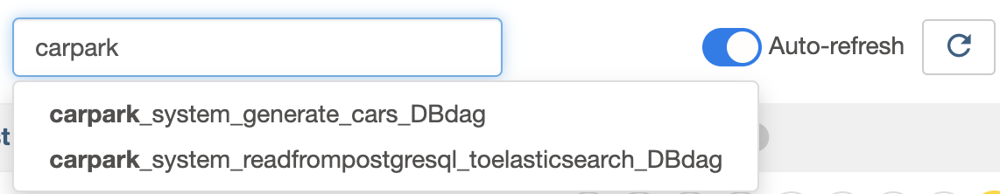
    
    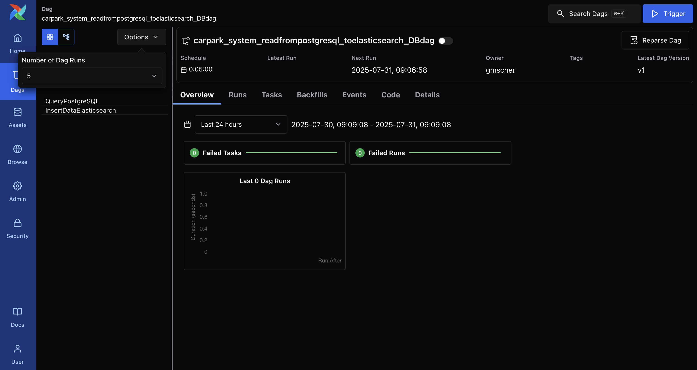

    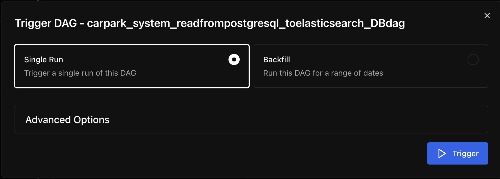

4. Select ```Options``` dropdown box and set ```Number of Dag Runs``` to 5 runs. Activate the Dag, click on the icon next to the dags' name. You should see the 5 runs and tasks in dark green. Click on the graph and task then view the logs in the Logs.

    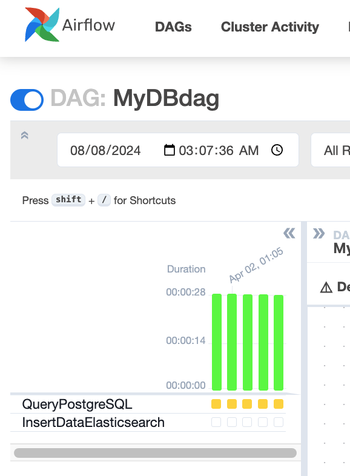

5. If the readPostgressql_writeElasticsearch.py and generateCars_insertPostgresql.py dag is successful you should see the index in kibana <a href="http://localhost:5601/">http://localhost:5601/</a>. Search for Index Management and you will see the index below. \
\
If InsertDataElasticSearch failed, ensure elasticsearch and kibana is started. If elasticsearch keeps restarting, ```sudo sysctl -w vm.max_map_count=262144``` or permanently set in server ```/etc/sysctl.conf``` and enter ```vm.max_map_count=262144```. If it is still not showing, ensure elasticsearch is up.

    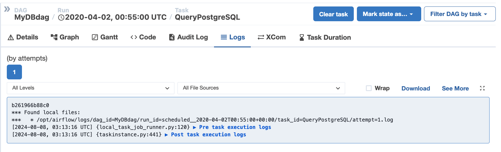

6. In ariflow, remember to switch off the batch processes by deactivating the dags.

    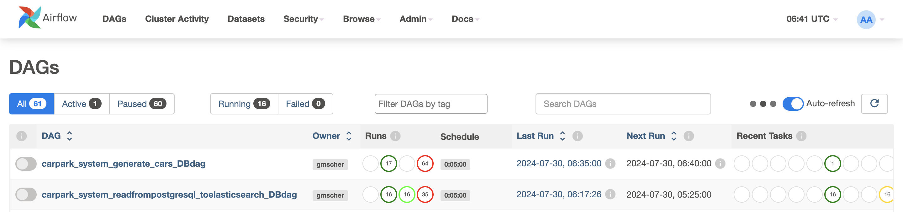

7. In kibana, search for Data View and create a Data View to explore your data. 

    Name: carpark_system
    Index pattern: fromposgresql*

    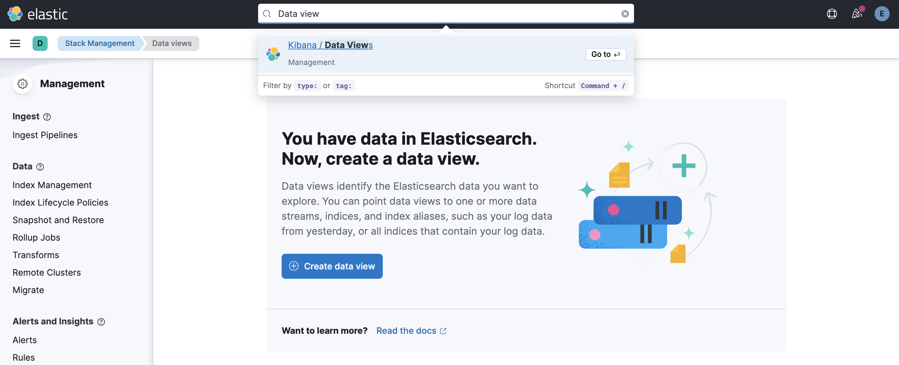
    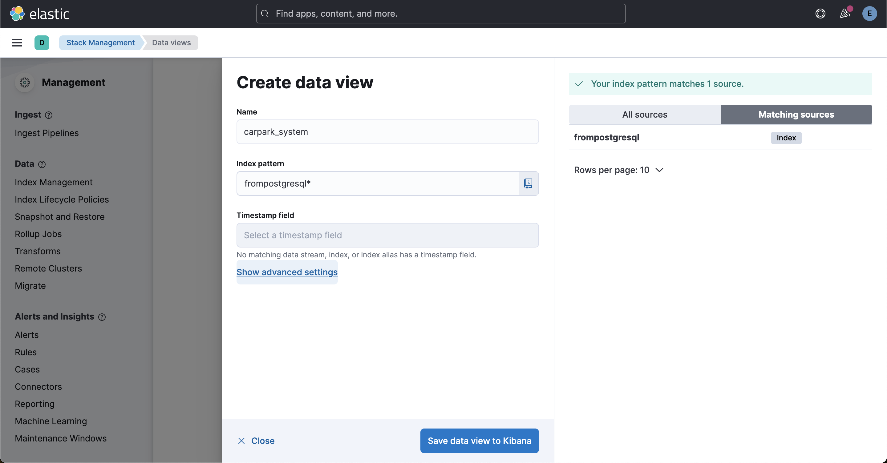
    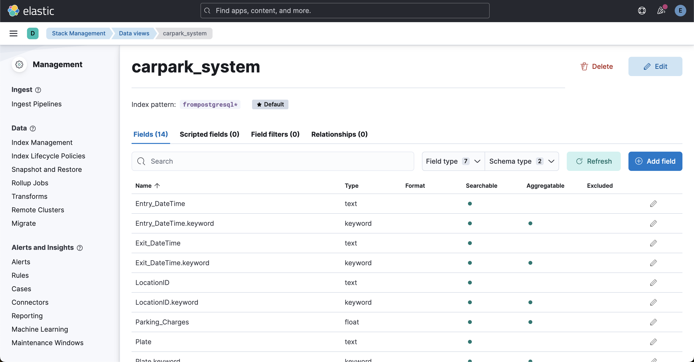
    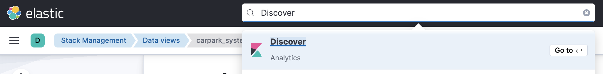
    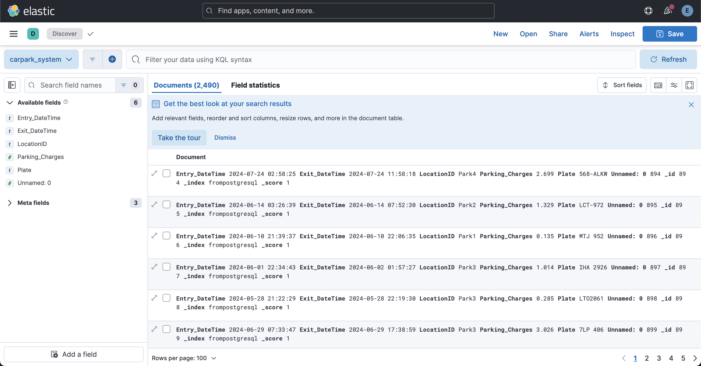
    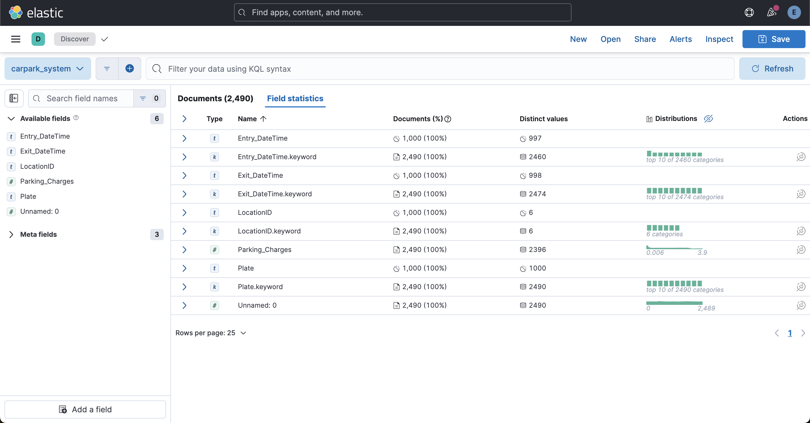
    

8. In kibana, search for Dashboard. Create your own dashboard to visualise and answer the questions below.

    - What is the top 5 average parking charges for each carpark location? \
    Screen capture your dashboard output and submit in the notebook. i.e. ``````

    <!--  -->
    <!--  -->


# Conclusion

In this lab, you have created the development environment on AWS EC2 instance's docker. This is to fully test the systems before pushing to a User Acceptance Test (UAT) environement and a live production server. We will not cover UAT and production environment in this course.  

1. You have successfully created a data pipeline batch process to generate cars data and inserted data into a relational database (posgresql).

2. You have successfully created a data pipeline batch process to read from the relational database and inserted the data into a NoSQL database (elasticsearch).

<b>Questions to ponder</b>
1. When do you need to use batch process?
2. Give an example of an application that require batch processing?
3. What are the advantages of Airflow batch processing compared to Microsoft Power Apps (MS Excel, MS Sharepoint, MS Power BI)?
4. What are the disadvantages?
5. What level of data maturity in an organisation is more suitable for this application?

# Submissions next Wed 9pm (15 Oct 2025)  

Submit your ipynb as a pdf. Save your ipynb as a html file, open in browser and print as a pdf. Include in your submission:

    For Section 2.4 Point 8. Screen capture the dashboard to answer the question and place your dashboard screencapture in the same ipynb.

    Answers the questions to ponder

~ The End ~
